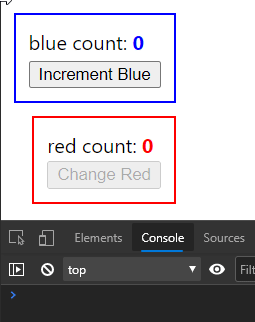
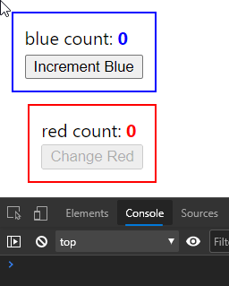
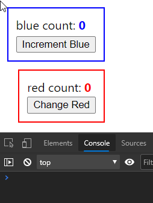
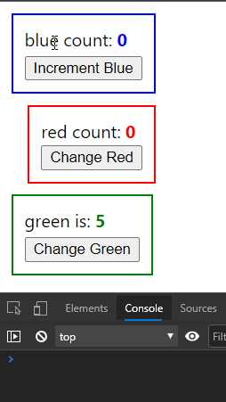
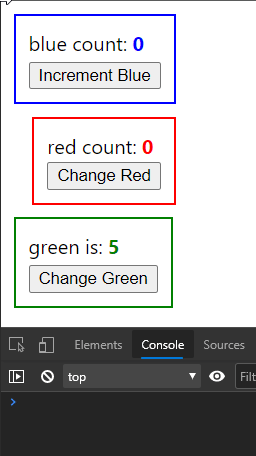

<a id="-"></a>

  - [What this guide is about?](#intro)
  - [React.memo](#memo)
  - [React.useCallback](#use-callback)
    - [Referential equality](#referential-equality)
    - [Referential equality cheat-sheet](#referential-equality-cheat-sheet)
    - [Optimizing with useCallback](#optimizing-with-use-callback)
  - [React.useMemo](#use-memo)
  - [Should I optimize everything from now on?](#optimize-everything)
  - [Additional Resources](#additional-resources)

<br>

<h2 id="intro"><a href="#-">^ What this guide is about?</a></h2>

If you, dear traveler, are anything like me and you still get confused about when you should use some of Reacts built-in methods and hooks. _I.e. memo, useMemo and useCalback_.

I'm glad you joined me. We will break down and analyze each of them and figure out when and how to use them.

These functions mean to help us optimize performance. But each has a specific use case.

<hr>

<h2 id="memo"><a href="#-">^ React.memo</a></h2>

We'll start with _React.memo_ first.

Let's say you have a Parent component that has a blue state with a number value that changes onClick inside it. And that Parent has a Child component to which we pass a red state, with a number value that never changes.

<h3>Parent</h3>

```tsx
const Parent: React.FunctionComponent = () => {
  const [blue, setBlue] = useState<number>(0);
  const [red] = useState<number>(0);

  const incrementBlueCount = () => {
    setBlue(blue + 1);
  };

  return (
    <div>
      <div className="parent">
        blue count: <span className="blue">{blue}</span>
        <button onClick={incrementBlueCount}>Increment Blue</button>
      </div>
      <Child childCount={red} />
    </div>
  );
};

export default Parent;
```

<h3>Child</h3>

```tsx
interface ChildProps {
  childCount: number;
}

const Child: React.FunctionComponent<ChildProps> = ({ childCount }) => {
  console.log('child renders');
  return (
    <div className="child">
      <div>
        red count: <span className="red">{childCount}</span>
      </div>
      <button disabled>Change Red</button>
    </div>
  );
};

export default Child;
```

If the blue state of the Parent bound to an onClick handler would have changed. Even though we wouldn't pass that state to the Child as a prop, the Child would still re-render.



<p align="center">
    <i>Child component re-renders by default each time when we change Parent's local state</i>
</p>

> ”When parent components' state changes React will recursively re-render all of its children. Unless we tell him no to.”

To fix that. We could wrap the Child component export with a _React.memo_ method.

```tsx
// ...
export default memo(Child);
```

And as simple as that, we told the Child component to re-render only when its props are actually changing.



<p align="center">
    <i>Child component does not re-render each time when we change Parent's local state</i>
</p>

<hr>

<h2 id="use-callback"><a href="#-">^ React.useCallback</a></h2>

To illustrate when we should be using the _useCallback_ hook, first, we will break the optimization of the Child component.

Let's create a function for changing the state which we are passing down to our Child, the red state.

Where that function would receive an argument as a number coming back from the Child. And inside the function we would call the state handler to set it to that new number.

Let's pass the function as a prop to the Child component.
And finally, let's add a function inside the Child component that will call the props function.

<h3>Parent</h3>

```tsx
// ...
const [red, setRed] = useState<number>(0);
// ...
const changeRedCount = (random: number) => {
  setRed(random);
};
// ...
<Child childCount={red} onClick={changeRedCount} />;
// ...
```

<h3>Child</h3>

```tsx
interface ChildProps {
  // ...
  onClick(num: number): void;
}
// ...
const onIncrementRedCountClick = () => {
  onClick(+(Math.random() * 1000).toFixed());
};
// ...
<button onClick={onIncrementRedCountClick}>Change Red</button>;
// ...
```

By simply passing the function as a prop, even if we were to click only the button in the Parent component. Triggering the blue state update, while not changing the red state, passed to the Child component. We would go back to the previous behavior where our Child would re-render on every local state change within the Parent.

So why does our _React.memo_ optimization break in that case? The reason to why that happens is _referential equality_.

<h3 id="referential-equality"><a href="#-">^ Referential equality</a></h3>

If you were to compare 2 variables with a same value,

```tsx
const x = 10;
const y = 10;
const isEqual = x === y; // true
```

the evaluation returns true.

But if you were to compare 2 objects, each with a key in it, whose value is 10

```tsx
const x = { key: 10 };
const y = { key: 10 };
const isEqual = x === y; // false
```

the evaluation returns false.

Because whenever we are comparing objects inside the JS, what we are actually comparing is their referential equality. Roughly, we're trying to check if both objects are allocated in the same space in memory.

If you were instead to say

```tsx
const x = { key: 10 };
const y = x;
// then
const isEqual = x === y; // true
```

But not because they are now both the same objects that have the same keys whose value is 10.

Instead, both of the variables are now pointing to the same space in memory. We don't have a new object but a new variable pointing to that same object.

<h3 id="referential-equality-cheat-sheet"><a href="#-">^ Referential equality cheat-sheet</a></h3>

```tsx
true === true // true
false === false // true
1 === 1 // true
'a' === 'a' // true
{} === {} // false
[] === [] // false
() => {} === () => {} // false
const x = {}
const y = x
x === y // true
```

<h3 id="optimizing-with-use-callback"><a href="#-">^ Optimizing with useCallback</a></h3>

Now to get back to our example. So far on every single render we are now creating a brand new function (object). And React is not trying to compare the values of the function prop, instead it is checking for referential equality. Latter being a slightly less expensive operation.

To fix that problem as well. Let's introduce the _useCallback_ hook. By creating a memoized callback function, throughout the whole life-cycle of the component, it will remain the same. The values passed to the function might change, but the function itself will stay referentially the same.

<h3>Parent</h3>

```tsx
// ...
const changeRedCount = useCallback((random: number) => {
  setRed(random);
}, []);
// ...
```

**Important** thing to remember when using the useCallback hook. As a rule of thumb, in the dependency array at the end we need to include anything that is being used inside the function. With a few exceptions.

Notice we are omitting the state setter _setRed_ as a dependency, as it is unnecessary since React ensures that the setter function will remain the same throughout the life-cycle of the component.

And the second **important** thing is; If you are using a helper function or a variable only inside the _useCallback_ function, instead of defining them outside its scope, nest everything inside the function body.

This improves readability, prevents unnecessary bugs, and allows you to avoid putting those helpers or vars as dependencies in the useCallback dependency array.

Now everything is back on track, and our Child component only re-renders when its props change.



<p align="center">
    <i>Child component only re-renders each time when we change Child's incoming props (red state)</i>
</p>

<hr>

<h2 id="use-memo"><a href="#-">^ React.useMemo</a></h2>

Final hook we can use to optimize our React components is a _useMemo_ hook.

Let’s first introduce a new, green state, inside our Parent component. An array of numbers. And what we’re going to want to see is the largest number from that array displayed on our page.

<h3>Parent</h3>

```tsx
// ...
const [green, setGreen] = useState<Array<number>>([1, 5, 3, 4, 2]);
// ...
const changeGreen = () => {
  setGreen([6, 10, 8, 9, 7]);
};

const highestNumber = () => {
  console.log('determining winner');
  return Math.max(...green);
};
// ...
<div className="winner">
  green is: <span className="green">{highestNumber()}</span>
  <button onClick={changeGreen}>Change Green</button>
</div>;
// ...
```

Presumably that would be an expensive operation, so we wouldn’t want to preform it on every single render. The way it is behaving right now.



<p align="center">
    <i>The highestNumber function is triggered each time when we change Parent's state. Or simply on every render</i>
</p>

Once again, let's intervene. We're going to change our _highestNumber_ function to return a memoized value. Using the _useMemo_ hook, as follows…

```tsx
// ...
const highestNumberMemoized = useMemo(() => {
    console.log('determining winner');
    return Math.max(...green);
  }, [green]);
// ...
green is: <span className="green">{highestNumberMemoized}</span>
// ...
```

Don't forget to add the green state as a dependency to the array at the end. To ensure that highestNumber gets recalculated only when the green state changes.

That's it. We can observe the fruits of our labor in action.



<p align="center">
    <i>The highestNumberMemoized function is triggered only when the green state changes</i>
</p>

<!-- <hr> -->

<!-- WIP Stale Props -->

<hr>

<h2 id="optimize-everything"><a href="#-">^ Should I optimize everything from now on?</a></h2>

Nope. There is no free lunch.

> When should you NOT use React memo?
>
> > ”I would assume that the same general advice applies for React.memo as it does for shouldComponentUpdate and PureComponent: doing comparisons does have a small cost, and there's scenarios where a component would never memoize properly (especially if it makes use of props.children). So, don't just automatically wrap everything everywhere. See how your app behaves in production mode, use React's profiling builds and the DevTools profiler to see where bottlenecks are, and strategically use these tools to optimize parts of the component tree that will actually benefit from these optimizations.”

As stated [here](https://github.com/facebook/react/issues/14463#issuecomment-448829902).

<h2 id="additional-resources"><a href="#-">^ Additional Resources</a></h2>

[When to useMemo and useCallback - by Kent C. Dodds](https://kentcdodds.com/blog/usememo-and-usecallback)

[Introducing Hooks - official React docs](https://reactjs.org/docs/hooks-intro.html)

[A Complete Guide to useEffect - by Dan Abramov](https://overreacted.io/a-complete-guide-to-useeffect/)

[Four Reasons React Renders (and three ways to stop it) - by Cory House](https://www.bitnative.com/2020/07/16/four-reasons-react-renders-and-three-ways-to-stop-it/)
